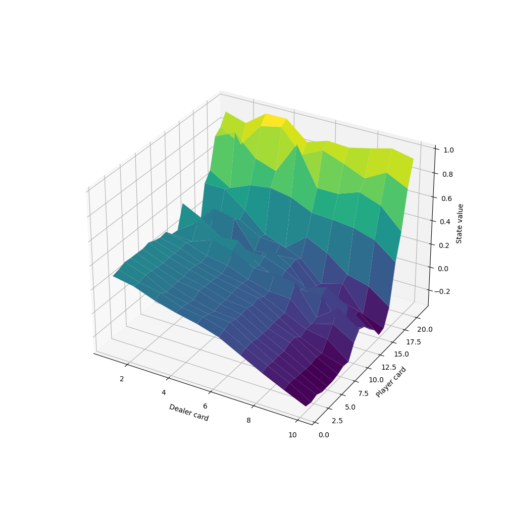
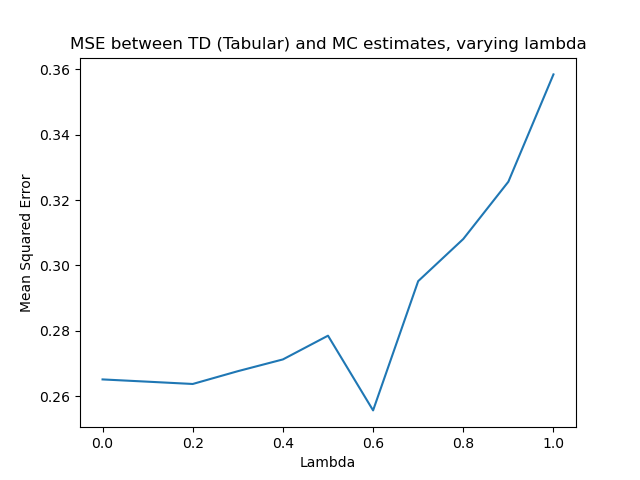
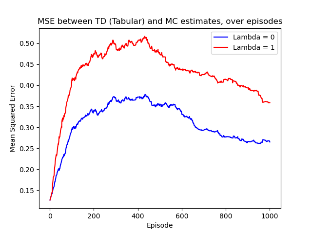
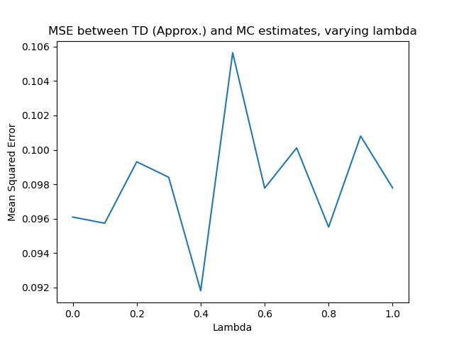
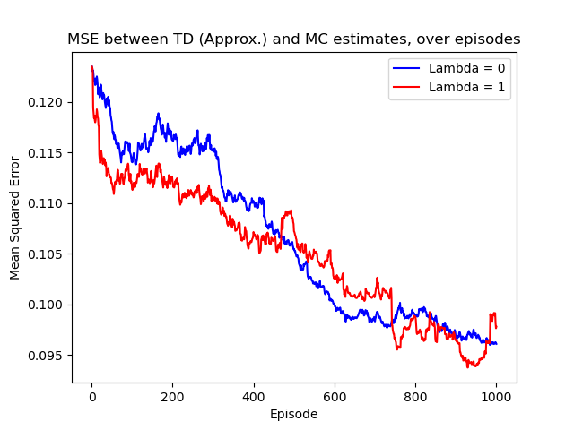

# Easy21
## Author: Daniel Mallia

A Python implementation of a solution to the Easy21 assignment from David
Silver's famous reinforcement learning course. The assignment can be found
here:
https://www.davidsilver.uk/wp-content/uploads/2020/03/Easy21-Johannes.pdf

### Run instructions:
You can obtain the below plots by running
```
python3 LearnEasy21.py
```

or explore the Development.ipynb notebook.

### Results
#### Monte-Carlo Control:
Below is the state value function learned via MC Control over 1,000,000
episodes: 


#### TD Control:
Below are the plots of mean squared error between TD and MC estimates, first
varying lambda, and then considering how these evolve over episodes for lambda
= 0 or 1.




#### Linear Function Approximation
Below are the plots of mean squared error between TD using linear function
approximation and MC estimates, first varying lambda, and then considering how
these evolve over episodes for lambda = 0 or 1.



