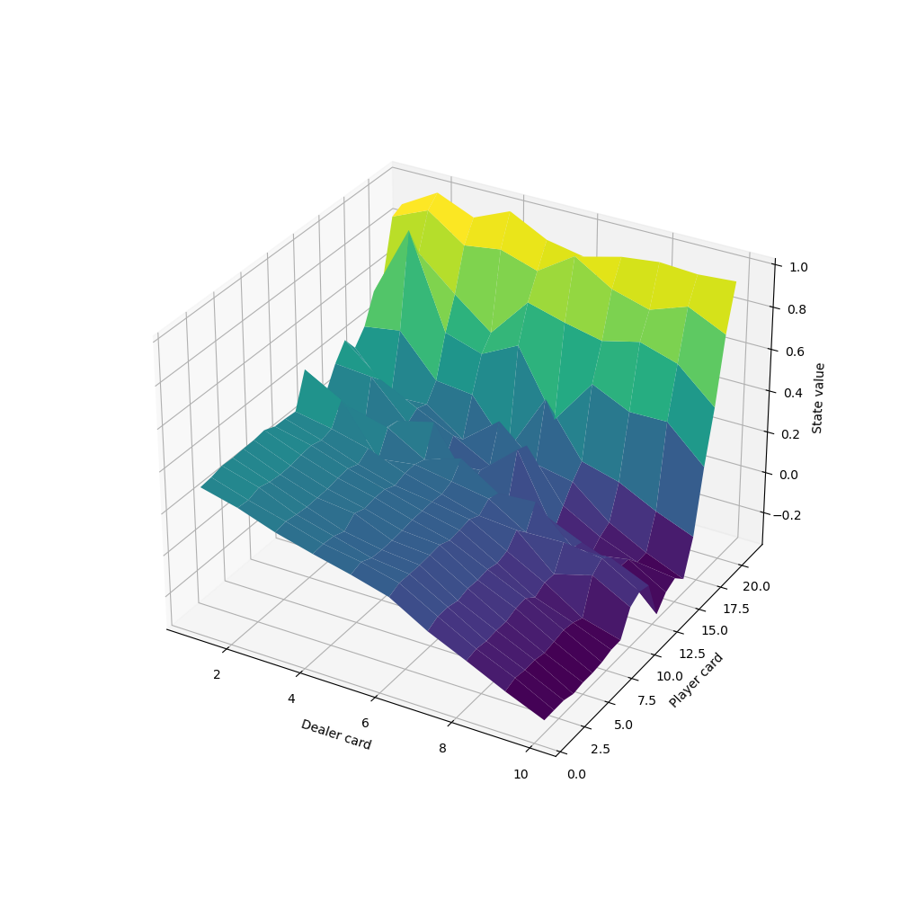

# Easy21
## Author: Daniel Mallia

A Python implementation of a solution to the Easy21 assignment from David
Silver's famous reinforcement learning course. The assignment can be found
here:
https://www.davidsilver.uk/wp-content/uploads/2020/03/Easy21-Johannes.pdf

Todo:
- [x] Part 1: Implementation of Easy21
- [x] Part 2: Monte-Carlo Control in Easy21
- [x] Part 3: TD Learning in Easy21
- [ ] Part 4: Linear Function Approximation in Easy21

#### Monte-Carlo Control:
Below is the state value function learned via MC Control over 1,000,000
episodes: 

#### TD Control:
Below are the plots of mean squared error between TD and MC estimates, first
varying lambda, and then considering how these evolve over episodes for lambda
= 0 or 1.

